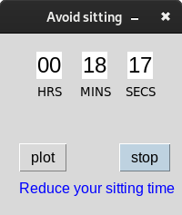
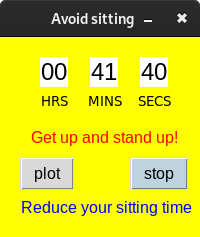
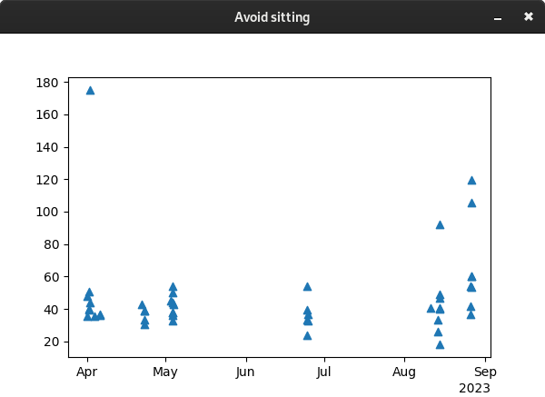

# Sitting is the new smoking.

Avoid sitting: GUI app built using Tkinter, Pandas, and Matplotlib

This small app tells you how many minutes you have been sitting. Displaying a warning after 35 minutes. The main window appears over all windows, to remind you to stand up. Unless [Stop] button is not pressed, the background of the window and its omnipresence will not be reset up.

The app records data every time the [Stop] button is pressed and saves it to a temp file "sitting_app.csv" to later be plotted by pressing the [Plot] button on a new window.

Less sitting and More moving contribute to better health. Start by simply standing rather than sitting whenever possible. Follow these ways to improve your health:

- Take a break from sitting every 30 minutes.
- Stand while talking on the phone or watching television.
- If you work at a desk, try a standing desk — or improvise with a high table or counter.
- Walk with your colleagues for meetings rather than sitting in a conference room.
- Position your work surface above a treadmill — with a computer screen and keyboard on a stand or a specialized treadmill-ready vertical desk — so that you can be in motion throughout the day.

## How to execute

$ python3 avoid_sitting.py 2023/03/28

 Release

Not available.

## Running Environment
Back in 2018 the only working PC I had was this Acer notebook I bought back in 2009, almost 10yrs and operating just fine.

Unfortunately its end came in 2021, it won't start, probably the BIOS battery run out, or something else. The HDD still works though.

- OS: Debian 9
- PC: Sony vaio J-series, previously Acer aspire one Atom Proc/RAM 2GB
- Editor: Emacs
